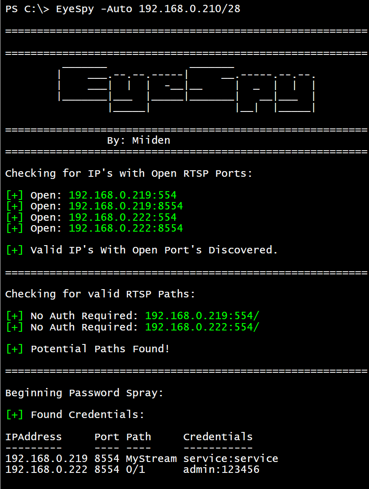

# EyeSpy

<p align="Center">

</p>

EyeSpy is a tool designed to enumerate and gain access to IP Cameras via RTSP. It provides a flexible and efficient way to scan for open RTSP ports, Check if authentication is required and attempt common credential spraying attacks.

## Table of Contents

- [Introduction](#introduction)
- [Installation](#installation)
- [Usage](#usage)
- [Examples](#examples)
- [Contributing](#contributing)
- [License](#license)

## Introduction

EyeSpy is developed by Miiden and utilizes PowerShell to help with penetration tests and research from a windows environment.
EyeSpy is designed to enumerate and gain access to IP Cameras via RTSP. It provides a flexible and efficient way to scan for open RTSP ports, Check if authentication is required and attempt common credential spraying attacks.

## Installation

There is no specific installation required for EyeSpy. Simply download the script and run it using PowerShell.
You may need to be in Bypass mode to run scripts:

```powershell
powershell -ep bypass
```

### Run EyeSpy in Memory
```powershell
IEX(new-object net.webclient).downloadstring('https://raw.githubusercontent.com/Miiden/EyeSpy/main/EyeSpy.ps1')
```
### Example
```powershell
IEX(new-object net.webclient).downloadstring('https://raw.githubusercontent.com/Miiden/EyeSpy/main/EyeSpy.ps1');EyeSpy -Auto 10.10.10.0/24
```

## Usage

EyeSpy provides several command-line options to customize its behavior:

- `-Search <IP/CIDR>`: Scan a single IP or CIDR range for open RTSP ports.

- `-NoAuth <IP/CIDR>`: Scan for open RTSP ports and spray for common paths. Returns any camera with no authentication required, by checking common camera paths with no authentication header.

- `-AuthAttack <IP:PORT>`: Perform a Password Spray attack on the specified IP:PORT.

- `-AuthAttack <IP:PORT> -Path 'KnownPath'`: Perform a Password Spray attack on the specified IP:PORT/PATH, Assumes path is correct and does not test for "NoAuth".
   
- `-Auto <IP/CIDR>`: Perform a fully automatic scan within a specified IP range (CIDR notation). This scan will find open ports, and spray each path with combinations of common/default credentials.
  
- `-Help`: Display the help menu, showing usage instructions and examples.


## Examples

### Search for common open RTSP ports on a single IP or across a range.
```powershell
EyeSpy -Search 192.168.0.1/24
```
### Searches for common open RTSP ports and checks common paths if authentication is required.
```powershell
EyeSpy -NoAuth 192.168.0.123
```
 
### Performs a password spraying attack with common credentials on a known open IP:Port
```powershell
EyeSpy -AuthAttack 192.168.0.66:8554
```

### Performs a password spraying attack with common credentials on a known open IP:Port/Path
```powershell
EyeSpy -AuthAttack 192.168.0.123:554 -Path 'MyStream'
```

### Performs all of the above automatically across a single IP or Range
```powershell
Eyespy -Auto 192.168.0.1/24
```
<p align="Left">

</p>

### Displays the Help
```powershell
Eyespy -Help
```

## Contributing
Contributions to EyeSpy are welcome. Feel free to fork the repository, make improvements, and submit pull requests.

## Disclaimer
EyeSpy is designed for research, educational, and authorized testing scenarios. The purpose of developing and distributing EyeSpy is to provide professionals and researchers with a tool to understand and identify vulnerabilities and to bolster the security of systems. It is fundamentally imperative that users ensure they have obtained explicit, mutual consent from all involved parties before applying this tool on any system, network, or digital environment.

Engaging in unauthorized activities, including, but not limited to, accessing systems without permission, can lead to severe legal consequences. Users must be fully aware of, and adhere to, all their jurisdictional, local, state, and federal laws and regulations concerning cybersecurity and digital access.

The developers and contributors of EyeSpy expressly disclaim all liabilities and responsibilities for any unauthorized or illicit use of the tool. Additionally, they are not responsible for any consequent damages, losses, or repercussions stemming from the misuse or misapplication of EyeSpy.

## License
EyeSpy is licensed under the [MIT](https://github.com/Miiden/EyeSpy/blob/main/LICENSE.md) License.
